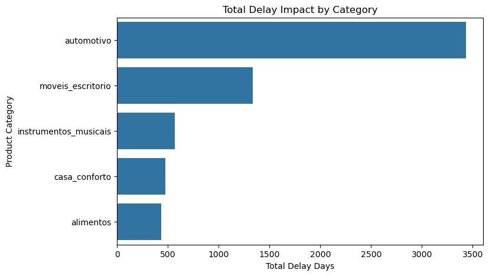
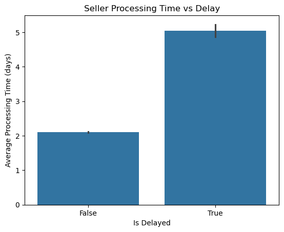
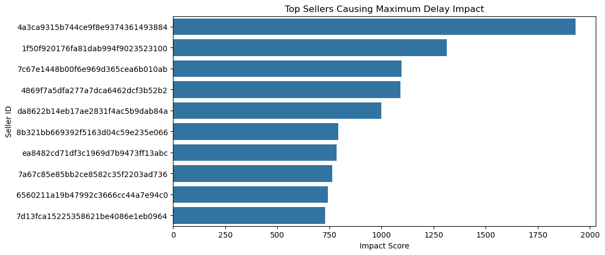
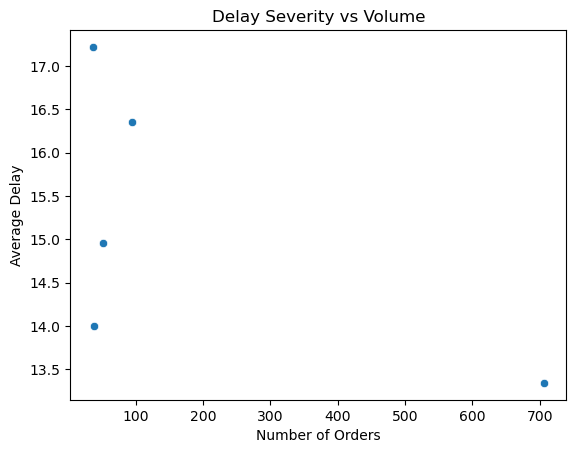

# 🚀 Delivery Delay Analysis

## 📌 Project Overview
This project analyzes an e-commerce dataset to identify the key factors causing delivery delays.

---

## 🎯 Objective
To understand why orders are delayed and identify patterns across cities, product categories, and logistics.

---

## 🛠️ Tools & Technologies
- Python
- Pandas (Data Manupulation)
- Matplotlib & Seaborn (Data Visualization)
- Jupyter Notebook

---

## 📊 Key Insights
- Certain cities (e.g., Rio de Janeiro) show higher delivery delays  
- Specific product categories experience consistent delays  
- Logistics inefficiencies contribute significantly to late deliveries  

---

## 💡 Recommendations
- Improve logistics operations in high-delay regions  
- Optimize delivery handling for affected product categories  
- Monitor seller performance more closely  

---

## 📁 Project Files
- delivery_delay_analysis.ipynb → Full analysis notebook  

---

## 📷 Visual Insights
### 1. Total Delay Impact by Category

**Insight:** Automotive category contributes the highest total delay,indicating potential inefficiencies in this segment.

---

### 2. Seller Processing Time vs Delay

**Insight:** Orders with longer seller processing times are more likely to be delayed,highlighting seller-side inefficiencies.

---

### 3. Top Sellers Causing Delay

**Insight:** A small group of sellers contributes disproportionately to delays,suggesting targeted monitoring can reduce overall delays.

---

### 4. Delay Severity vs Volume

**Insight:** High-volume regions with frequent delays should be prioritized for logistics optimization.
